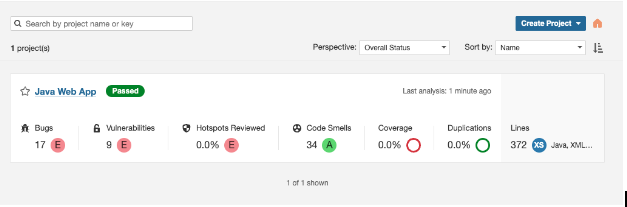

# CaYC-research
Clean as You Code research

Issues in code accumulate over time and can contribute to code-level technical debt. Technical debt leads to lower product quality, increased security risks, reduced developer velocity, efficiency, and morale. Based on an examination of more than 200 projects within a span of 12 months, our research was able to estimate the cost attributed to accumulated code-level technical debt. The study also proposes an alternate way to avoid these costs upfront.

This research estimates that developers spend 33% of their time dealing with technical debt, equating to productivity loss and a significant cost to companies annually. Over and above this direct developer cost, the negative impact of technical debt can result in lower product quality, increased security risks, worsening business results, and reduced developer velocity, efficiency, and morale.

This is the list of projects analyzed on the report:
```
plsql:3dcitydb	
abapGit	
abseil	 (https://github.com/abseil/abseil-cpp.git)
activiti-root	
afnetworking	 (https://github.com/AFNetworking/AFNetworking.git)
airsim	 (https://github.com/Microsoft/AirSim.git)
php:akeneo	
scala:akka-http	
alibaba-mnn	 (https://github.com/alibaba/MNN.git)
scala:alpakka	
scala:alpakka-kafka	
ansible	
org.apache.bcel:bcel	
org.apache.commons:commons-collections4	
org.apache.commons:commons-configuration2	
org.apache.commons:commons-exec	
commons-logging:commons-logging	
org.apache.commons:commons-pool2	
org.apache.commons:commons-vfs2-project	
org.apache.empire-db:empire-db-parent	
httpd	 (https://github.com/apache/httpd.git)
org.apache.jackrabbit:jackrabbit	
kafka	
scala:incubator-openwhisk	
org.apache.portals.pluto:pluto	
org.apache.rocketmq:rocketmq-all	
scala:apache-spark	
thrift	 (https://github.com/apache/thrift.git)
thrift-compdb	
org.apache:tomcat7	
org.apache:tomcat8	
org.apache:tomcat9	
apex:financialforcedev:apex-mdapi	
aragondb	 (https://github.com/arangodb/arangodb.git)
aragondb1804	 (https://github.com/arangodb/arangodb.git)
aria2	 (https://github.com/aria2/aria2.git)
ls1intum:artemis	
aspnetcore	
automatic-graph-layout	
iac:awslabs-templates	
iac:aws-samples	
aws-sdk	
php:backup-manager	
bash	 (https://github.com/bminor/bash.git)
bash-buildroot-aarch64	 (https://github.com/bminor/bash.git)
bash-linaro-aarch64	 (https://github.com/bminor/bash.git)
php:behat	
benchmark-dot-net	
bind	 (https://gitlab.isc.org/isc-projects/bind9.git)", "force_version" "v9_12_3
binutils	 (https://github.com/bminor/binutils-gdb.git)
biopython	
bitcoin	 (https://github.com/bitcoin/bitcoin.git)
bitwarden-core	
bolts-ios-simulator	 (https://github.com/BoltsFramework/Bolts-ObjC.git)
boost	 (https://github.com/boostorg/boost.git)
boost-windows	 (https://github.com/boostorg/boost.git)
build-wrapper-linux	 (https://x-access-token${GITHUB_TOKEN}@github.com/SonarSource/sonar-cpp.git)
build-wrapper-linux-compdb	
build-wrapper-windows	 (https://x-access-token${GITHUB_TOKEN}@github.com/SonarSource/sonar-cpp.git)
build-wrapper-windows-vs2017	 (https://x-access-token${GITHUB_TOKEN}@github.com/SonarSource/sonar-cpp.git)
bullet3	 (https://github.com/bulletphysics/bullet3.git)
busybox	 (https://github.com/mirror/busybox.git)
peachee-python-ansible-bogdan	
php:cakephp	
php:codeception	
cataclysm-dda	 (https://github.com/CleverRaven/Cataclysm-DDA.git)
catch2	 (https://github.com/catchorg/Catch2.git)
org.apache.cayenne:cayenne-parent	
ccache	 (https://github.com/ccache/ccache.git)
ccache-compdb	
ceph	 (https://github.com/ceph/ceph.git)
ceph-compdb	
ChakraCore	 (https://github.com/Microsoft/ChakraCore
ChakraCore-linux	 (https://github.com/Microsoft/ChakraCore
iac:checkov	
com.puppycrawl.tools:checkstyle	
chromium	
cinder	 (https://github.com/cinder/Cinder.git)
php:civicrm	
clang	 (https://github.com/llvm/llvm-project.git)
clang-compdb	
clickhouse	 (https://github.com/ClickHouse/ClickHouse.git)
cloudscribe	
cmake	 (https://github.com/Kitware/CMake.git)
cmake1604	 (https://github.com/Kitware/CMake.git)", "force_version" "v3.21.5
cmake1804	 (https://github.com/Kitware/CMake.git)
cmake-compdb	
org.codefx.demo:java-x	
php:codeigniter226	
php:codeigniter3	
php:codeigniter4	
net.code-story:http	
apex:financialforcedev:flib-apex-common	
compile-time-regular-expressions	 (https://github.com/hanickadot/compile-time-regular-expressions.git)
php:composer	
com.sonarsource:security-expected-issues:iac	
com.sonarsource:security-expected-issues:java-frameworks	
coroutine-windows	 (https://github.com/luncliff/coroutine.git)
cpython	 (https://github.com/python/cpython.git)
python:cpython	
php:craftcms	
csharp-language-server-protocol	
net.masterthought:cucumber-reporting	
apex:SalesforceFoundation:Cumulus	
curl	 (https://github.com/curl/curl.git)
darktable	 (https://github.com/darktable-org/darktable.git)
date	 (https://github.com/HowardHinnant/date.git)
mesosphere:dcos-commons	
apex:afawcett:declarative-lookup-rollup-summaries	
django-DefectDojo	
devilutionx	 (https://github.com/diasurgical/devilutionX.git)
ruby:dev.to	
ruby:discourse	
django	
django-cms	
django-oscar	
dnn	
io.fabric8:docker-maven-plugin	
php:doctrine2	
php:dolibarr	
dolphin	 (https://github.com/dolphin-emu/dolphin.git)
dosbox-staging	 (https://github.com/dosbox-staging/dosbox-staging.git)
dotnet-runtime	
dovecot-core	 (https://github.com/dovecot/core.git)
doxygen	 (https://github.com/doxygen/doxygen.git)
drogon	 (https://github.com/an-tao/drogon.git)
php:drupal	
php:easyadminbundle	
elasticsearch-net	
envoy	 (https://github.com/envoyproxy/envoy.git)
eve	 (https://github.com/jfalcou/eve.git)
io.fabric8:fabric8-maven-plugin-build	
com.facebook:buck	
facebook-ios-sdk	 (https://github.com/facebook/facebook-ios-sdk.git)
faiss	 (https://github.com/facebookresearch/faiss.git)
ffmpeg	 (https://github.com/FFmpeg/FFmpeg.git)
firefox	 (https://github.com/mozilla/gecko-dev.git)
flameshot	 (https://github.com/flameshot-org/flameshot.git)
org.sonarsource.flex:flex	
fmt	 (https://github.com/fmtlib/fmt.git)
folly	 (https://github.com/facebook/folly.git)
php:fosuserbundle	
foundationdb	 (https://github.com/apple/foundationdb.git)
fprime	 (https://github.com/nasa/fprime.git)
gcc	 (https://github.com/gcc-mirror/gcc.git)
git	 (https://github.com/git/git.git)
ruby:gitlab	
goaccess	 (https://github.com/allinurl/goaccess.git)
godot	 (https://github.com/godotengine/godot.git)
php:goodwork	
google-benchmark	 (https://github.com/google/benchmark.git)
gource	 (https://github.com/acaudwell/Gource.git)
php:grav	
gravity	 (https://github.com/marcobambini/gravity.git)
grpc	 (https://github.com/grpc/grpc.git)
com.google.guava:guava-parent	
guetzli	 (https://github.com/google/guetzli.git)
guilite	 (https://github.com/idea4good/GuiLite.git)
php:guzzle	
hhvm	 (https://github.com/facebook/hhvm.git)
com.zaxxer:HikariCP	
ruby:brew	
hotchocolate	
htop	 (https://github.com/hishamhm/htop.git)
thc-hydra	 (https://github.com/vanhauser-thc/thc-hydra.git)
hyperscan	 (https://github.com/intel/hyperscan.git)
php:infection	
php:invoiceninja	
python-ipython	
iterm2	 (https://github.com/gnachman/iTerm2.git)
org.jacoco:root	
jadx	
net.java.openjdk:jdk9	
php:jeedom	
org.eclipse.jetty:jetty-project	
io.git)hub.jhipster.sample:jhipster-sample-application	
php:joomla	
js:ag-grid	
js:angular	
js:ant-design-windows	
js:apollo-server	
js:browser-quest	
js:closure:library	
js:directus	
js:dojo	
js:desktop	
js:gutenberg	
js:material2	
js:nextjs	
js:openssf	
js:react-native	
js:security-expected-issues:javascript-frameworks	
js:vscode	
js:vue	
juce	 (https://github.com/juce-framework/JUCE.git)
karabiner	 (https://github.com/pqrs-org/Karabiner-Elements.git)
keepassxc	 (https://github.com/keepassxreboot/keepassxc.git)
python-keras	
iac:kics	
org.xwiki.commons:xwiki-commons:9.3.1	
kotlin:kotlin-compiler	
kotlin:swiss-corona-app	
kotlin:kpspemu	
kotlin:ktor	
org.codehaus.sonar-plugins.l10n:sonar-l10n-fr-plugin	
php:lairdubois	
php:laravel	
php:laravel-datatables	
php:laravel-dompdf	
php:laravel-excel	
php:laravelframework	
learnopengl	 (https://github.com/JoeyDeVries/LearnOpenGL.git)
leveldb	 (https://github.com/google/leveldb.git)
leveldb1604	 (https://github.com/google/leveldb.git)
leveldb1804	 (https://github.com/google/leveldb.git)
libcoro	 (https://github.com/jbaldwin/libcoro.git)
libmicrohttpd	 (https://git.gnunet.org/libmicrohttpd.git)
libreoffice	 (https://github.com/LibreOffice/core.git)
libressl	 (https://github.com/libressl-portable/portable
libuv	 (https://github.com/libuv/libuv.git)
lightgbm	 (https://github.com/Microsoft/LightGBM.git)
lightgbm-windows	 (https://github.com/Microsoft/LightGBM.git)
apex:SalesforceLabs:MilestonesPM	
php:LimeSurvey	
localstack	
locust	
php:magento2	
mantle	 (https://github.com/Mantle/Mantle.git)
marblemarcher	 (https://github.com/HackerPoet/MarbleMarcher.git)
ruby:mastodon	
php:matomo	
micrometer-metrics:micrometer	
org.javamoney:moneta-peach	
mongodb	 (https://github.com/mongodb/mongo.git)
mongodb-windows	 (https://github.com/mongodb/mongo.git)
moodle	
```

In order to get the results, an analysis has to be done on every project, and upload the results to a SonarQube instance.

To do this a list of steps should be followed:

1. Clone the repository
```
git clone {github url}
```
1. Have a SonarQube instance running (login the first time to change the pass)
```
docker run --rm -d --name sonarqube -p 9000:9000 -e SONAR_ES_BOOTSTRAP_CHECKS_DISABLE=true sonarqube:latest
```
1. For Java projects, run the analysis, for each one
```
 mvn clean verify sonar:sonar -Dsonar.login={sonarqube user} -Dsonar.password={sonarqube user pass} -Dsonar.host.url=http://localhost:9000
```
1. See the results in the SonarQube UI, opening the browser on http://localhost:9000


